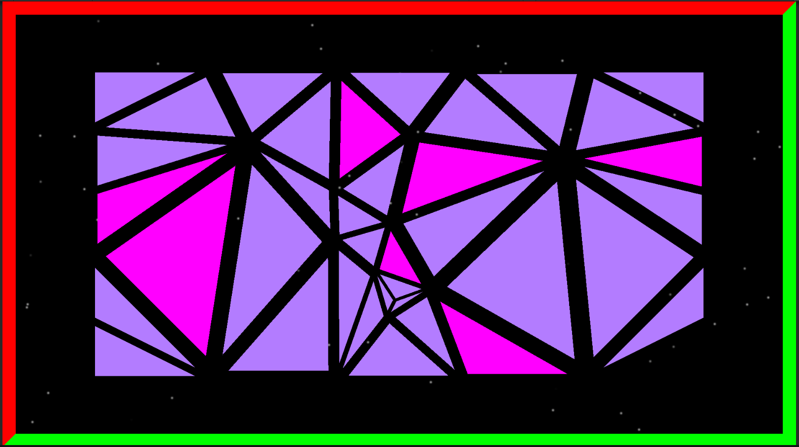

# Triangone

This repository contains the source code for the project Triangone - A puzzle game.

## Instructions

You have to remove the puzzle pieces of the screen one by one, without letting the pieces touch each other. It is not easy as you think it is.. 
The screen is surrounded by walls. The pieces should not touch the red walls at any point. The pieces will be locked randomly.
You win if all the pieces are removed.

Following image shows a snapshot of the gameplay.

## Technical Details

The levels are generated using Delaunay Triangulation method. The complexity and difficulty of the level  can be adjusted by modifying the level generation parameters.
